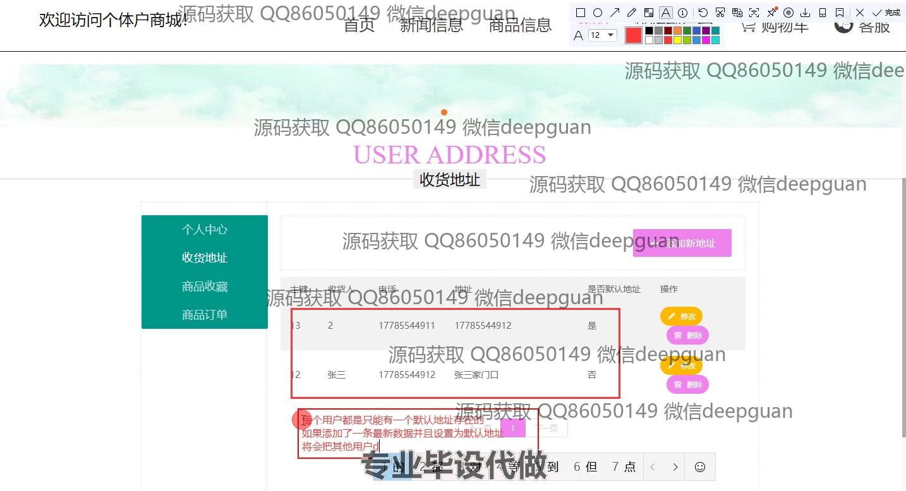
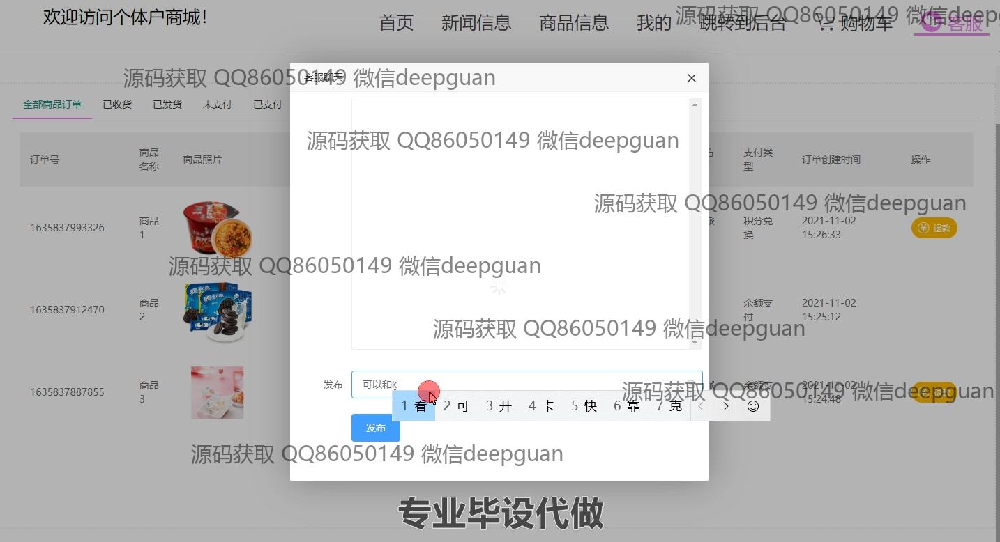
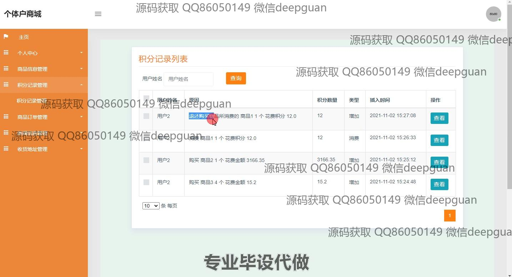
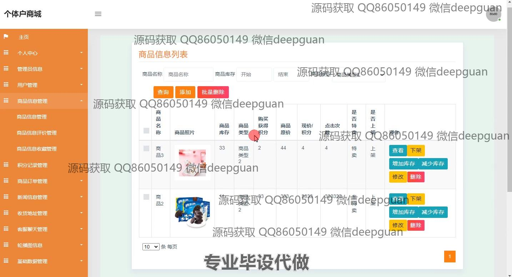
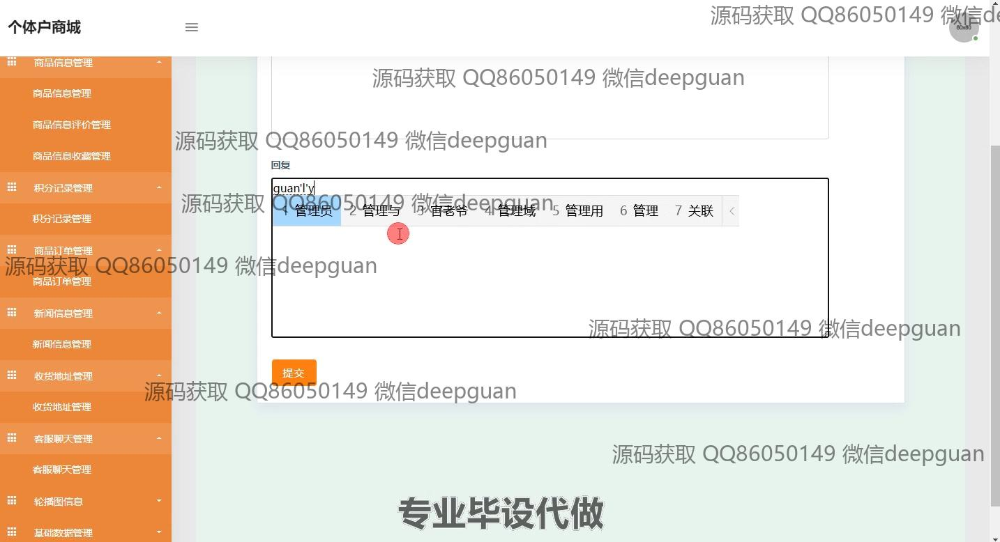

<h1 align="center">个体户商城的设计与实现+jsp</h1>

## 简介
个体户商城：角色分为管理员、用户；功能包括用户注册、商品管理、订单管理、会员等级管理、收货地址管理，使用SSM框架和前端技术构建，实现简洁明了的电子商务平台。    --计算机毕业设计源码；毕设源码；java毕业设计源码

## 联系方式

<h3 align="center">获取完整代码与数据库文件 + 微信：deepguan QQ: 86050149 QQ群: 783742310</h3>

<h3 align="center">可帮忙远程部署 包运行成功！提供远程部署、修改代码、设计文档指导、代码讲解等服务！</h3>

## 功能介绍（完整见运行截图）
用户：提供注册功能，通过输入账号、密码、手机号和身份证号等信息创建账户；登录后可访问个体户商城的首页，通过导航栏访问新闻、商品、购物车等模块。用户可以在个人中心管理个人信息，包括修改账户和联系方式，查看积分和会员等级。在购物过程中用户可以选择商品，查看详情和库存情况，添加至购物车，选择收货地址及支付方式确认订单，并管理订单状态，包括查看，评价和申请退款。

管理员：拥有商城后台管理权限，登录后可以通过功能模块管理用户、商品、积分、订单、新闻等信息。商品管理包括商品的添加、删除、编辑和查看，支持批量操作和上下架功能。订单模块允许管理员查看订单状态和处理退款请求。管理员亦能在新闻管理中发布和修改新闻条目，通过会员等级管理为用户设置不同的折扣等级。整个管理系统旨在便于数据维护和商城内容更新，提升运营效率。

## 运行截图

本代码来源于网络,仅供学习参考使用!

